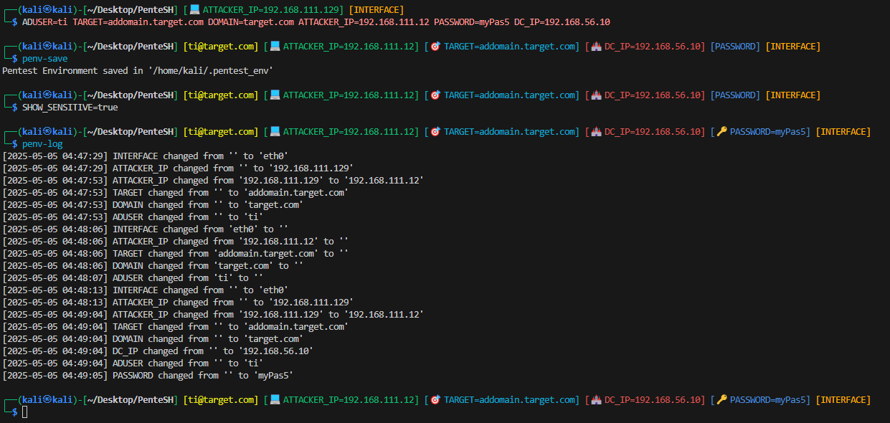
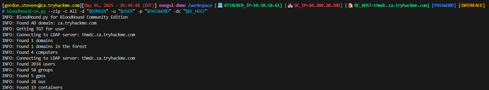
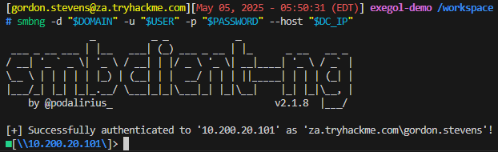

# PenteSH

**PenteSH** is a portable, Exegol- and Kali-compatible Zsh configuration that helps you manage and persist your pentesting environment seamlessly — all from your terminal.

Track critical context like `ATTACKER_IP`, `TARGET`, and `DOMAIN`, with automatic updates, persistent storage, and a smart prompt overlay.

*Example usage in Kali Linux*



*Example with bloodhound-ce on Exegol*



*Example with smbclient-ng on Exegol*



## 📚 Summary

- [🎯 Purpose](#-purpose)
- [🧠 Tracked Variables](#-tracked-variables)
- [🔧 Features](#-features)
- [🚀 Quick Start](#-quick-start)
- [💻 Commands](#-commands)

## 🎯 Purpose

- ✅ Detects and identifies whether you're running inside **Exegol** or **Kali Linux**.
- ✅ Automatically manages variables like `INTERFACE`, `ATTACKER_IP`, `TARGET`, `DOMAIN`, `DC_IP`, etc.
- ✅ Updates `ATTACKER_IP` dynamically if your interface changes.
- ✅ Logs every change to tracked variables in a persistent `.pentesh_env.log` file.
- ✅ Enhances your Zsh prompt with contextual information.
- ✅ Automatically saves the pentest session state after each command and upon shell exit.
- ✅ Loads and saves the environment automatically with fallbacks if needed.

---

## 🧠 Tracked Variables

| Variable       | Description                         |
|----------------|-------------------------------------|
| `INTERFACE`    | Network interface used for attacks  |
| `ATTACKER_IP`  | Attacker's IP bound to `INTERFACE`  |
| `TARGET`       | Target hostname or IP               |
| `DOMAIN`       | Target AD domain                    |
| `DOMAIN_SID`   | SID of the target domain            |
| `DC_IP`        | Domain controller IP                |
| `DC_HOST`      | Domain controller hostname          |
| `AD_CS`        | AD Certificate Services IP          |
| `AD_USER`      | AD username                         |
| `PASSWORD`     | AD password                         |
| `NT_HASH`      | NTLM hash of the user               |

---

## 🔧 Features

- **Auto-detection** of environment (`kali`, `exegol`)
- **Smart prompt** that displays AD context, IPs, and more
- **Automatic IP updates** when network interface changes
- **Persistent session saving** on every prompt return (`precmd`)
- **Change tracking** for audit/debug use
- **Auto-load and auto-save environment** with fallbacks

---

## 🚀 Quick Start

### Installation on Kali Linux (without Exegol)

- Using cURL
```bash
zsh -c "curl -fsSL 'https://raw.githubusercontent.com/N1borg/PenteSH/refs/heads/main/pentesh.zsh' -o \$HOME/.pentesh.zsh && echo 'source \$HOME/.pentesh.zsh' >> \$HOME/.zshrc"
```

- Using Wget
```bash
zsh -c "wget -qO \$HOME/.pentesh.zsh 'https://raw.githubusercontent.com/N1borg/PenteSH/refs/heads/main/pentesh.zsh' && echo 'source \$HOME/.pentesh.zsh' >> \$HOME/.zshrc"
```

### Installation on Kali Linux with Exegol `:)`

- Using cURL
```bash
zsh -c "curl -fsSL 'https://raw.githubusercontent.com/N1borg/PenteSH/refs/heads/main/pentesh.zsh' -o \$HOME/.exegol/my-resources/setup/zsh/zshrc && echo 'source \$HOME/.exegol/my-resources/setup/zsh/zshrc' >> \$HOME/.zshrc"
```

- Using Wget
```bash
zsh -c "wget -qO \$HOME/.exegol/my-resources/setup/zsh/zshrc 'https://raw.githubusercontent.com/N1borg/PenteSH/refs/heads/main/pentesh.zsh' && echo 'source \$HOME/.exegol/my-resources/setup/zsh/zshrc' >> \$HOME/.zshrc"
```

Then source your ZSH configuration or restart your terminal:
```bash
source $HOME/.zshrc
```

## 💻 Commands

| Command         | Description                              |
|----------------|-------------------------------------------|
| `penv`         | Show current environment                  |
| `penv-reset`   | Reset all current environment variables |
| `penv-save`    | Save current environment to a given file ($PENTESH_ENV_PATH by default) |
| `penv-del`     | Delete saved given environment ($PENTESH_ENV_PATH by default) |
| `penv-load`    | Load given environment ($PENTESH_ENV_PATH by default) |
| `penv-log`     | Show given environment change logs ($PENTESH_ENV_LOG_PATH by default) |
| `penv-log-clean` | Clean given environment change logs ($PENTESH_ENV_LOG_PATH by default) |
| `penv-help`    | Show help for available commands          |

## 🧰 Configuration

You can customize the behavior of the environment manager by adjusting the settings with the following global variables then saving the env (`penv-save`):

### 1. Boolean Variables

- `PENTESH_AUTO_LOAD_ENV`
    - **Type**: Boolean (`true` / `false`)
    - **Default**: `true`
    - **Description**: When set to `true`, the script will attempt to load the pentesting environment automatically from the specified file (`$PENTESH_ENV_PATH`) during shell startup. If the file doesn't exist, it initializes a new default environment.
- `PENTESH_SHOW_SENSITIVE`
    - **Type**: Boolean (`true` / `false`)
    - **Default**: `false`
    - **Description**: Controls whether sensitive values like `PASSWORD` and `NT_HASH` are displayed in the prompt. If set to `false`, sensitive values are not displayed.
- `PENTESH_AUTO_CHANGE_ATTACKER_IP`
    - **Type**: Boolean (`true` / `false`)
    - **Default**: `true`
    - **Description**: If enabled, the `ATTACKER_IP` will be automatically updated whenever the `INTERFACE` value is changed (e.g., on VPN toggle or network switch). Otherwise, it remains static unless changed manually

### 2. Environment Path Setup

- `PENTESH_ENV_PATH`
    - **Type**: String (Directory Path)
    - **Default**: `$HOME/.pentesh_env`
    - **Description**: The path of your default pentesting environment file.
- `PENTESH_ENV_LOG_PATH`
    - **Type**: String (Directory Path)
    - **Default**: `$PENTESH_ENV_PATH.log`
    - **Description**: The path of your pentesting environment log file.

## 📝 Logging Example

```log
[2025-05-05 04:56:25] INTERFACE changed from '' to 'eth0'
[2025-05-05 04:56:25] ATTACKER_IP changed from '' to '192.168.1.129'
[2025-05-05 05:20:20] PASSWORD changed from '' to 'Changeme123'
[2025-05-05 05:20:55] DOMAIN changed from '' to 'za.tryhackme.com'
[2025-05-05 05:21:12] DC_IP changed from '' to '10.200.20.101'
[2025-05-05 05:22:48] DC_HOST changed from '' to 'thmdc.za.tryhackme.com'
[2025-05-05 05:29:33] INTERFACE changed from 'eth0' to 'tun0'
[2025-05-05 05:29:44] INTERFACE changed from 'tun0' to 'breachad'
[2025-05-05 05:29:44] ATTACKER_IP changed from '192.168.111.129' to '10.50.18.61'
```

## 🛠️ PenteSH Environment Example

```bash
export INTERFACE='eth0'
export ATTACKER_IP='192.168.56.101'
export TARGET='192.168.56.110'
export DOMAIN='corp.local'
export DOMAIN_SID='S-1-5-21-123456789-987654321-1112131415'
export DC_IP='192.168.56.10'
export DC_HOST='dc01.corp.local'
export AD_CS='192.168.56.20'
export AD_USER='administrator'
export PASSWORD='P@ssw0rd!'
export NT_HASH=''
export AUTO_CHANGE_ATTACKER_IP='true'
export SHOW_SENSITIVE='true'
export AUTO_LOAD_ENV='true'
```

## To-Do

- Dynamic variables set (adding and removing our own variables) and so variables colors & emojis configuration
- Fix, on Exegol, `ATTACKER_IP` which changes only after the next prompt display when `INTERFACE` is modified, instead of updating immediately.
- `MACADDRESS` displayed in a possible Red Team mode for spoofing in rushing moments

## Possible ideas

- Add `$TargetObject` ?
