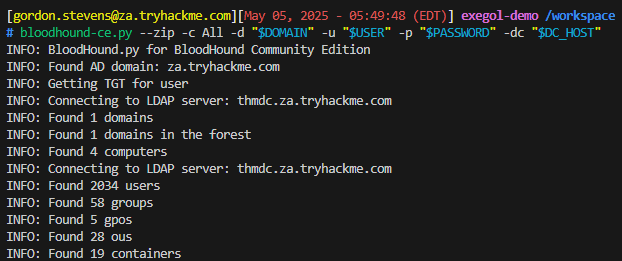

# PenteSH

<div>
  <a href="https://github.com/N1borg/PenteSH/stargazers"></a>
  <a href="https://www.linkedin.com/in/robin-caboche/"></a>
</div>

**PenteSH** is a customizable Zsh environment manager designed specifically for penetration testers and red teamers. It streamlines the process of tracking and managing key operational variables across different pentest sessions, helping you stay organized and informed in complex attack scenarios.

Track critical context like `ATTACKER_IP`, `TARGET`, and `DOMAIN`, with automatic updates, persistent storage, and a smart prompt overlay.

*Example usage in Kali Linux*


*Example with bloodhound-ce on Exegol*



*Example with smbclient-ng on Exegol*


## 📚 Table of contents

- [🚀 Quick Start](#-quick-start)
- [🎯 Purpose](#-purpose)
- [🧠 Tracked Variables](#-tracked-variables)
- [🔧 Features](#-features)
- [💻 Commands](#-commands)

## 🚀 Quick Start

### Installation on Kali Linux (without Exegol)

- Using cURL
```bash
sh -c "curl -fsSL 'https://raw.githubusercontent.com/N1borg/PenteSH/refs/heads/main/pentesh.zsh' -o \$HOME/.pentesh.zsh && echo 'source \$HOME/.pentesh.zsh' >> \$HOME/.zshrc"
```

### Installation on Kali Linux with Exegol `:)`

- Using cURL
```bash
sh -c "curl -fsSL 'https://raw.githubusercontent.com/N1borg/PenteSH/refs/heads/main/pentesh.zsh' -o \$HOME/.exegol/my-resources/setup/zsh/zshrc && echo 'source \$HOME/.exegol/my-resources/setup/zsh/zshrc' >> \$HOME/.zshrc"
```

Then source your ZSH configuration or restart your terminal:
```bash
source $HOME/.zshrc
```

Or with Exegol:
```bash
source $HOME/.exegol/my-resources/setup/zsh/zshrc
```

## 🎯 Purpose

- ✅ **Contextual Variable Management**: Centralizes important pentest variables such as `ATTACKER_IP`, `TARGET`, `DOMAIN`, and credentials, making them easy to set, update, and access.
- ✅ **Seamless Shell Integration**: Built on standard shell variable conventions, it works natively with global environment variables in Zsh (and Bash and others soon...). This allows tools, scripts, and one-liners to directly access your session’s variables without special wrappers or custom syntax.
- ✅ **Dynamic Network Adaptation**: Monitor your `INTERFACE` and automatically updates your `ATTACKER_IP` to reflect current network settings without manual intervention.
- ✅ **Change Auditing**: Logs every modification to tracked variables with timestamps, creating a persistent audit trail for accountability and troubleshooting.
- ✅ **Session Persistence**: Supports saving and loading of environment snapshots to disk, allowing you to pause and resume complex engagements seamlessly.
- ✅ **User-Friendly Controls**: Provides intuitive command aliases and help commands to manage your pentest environment with minimal friction.

## 🧠 Tracked Variables

| Variable       | Description                         |
|----------------|-------------------------------------|
| `AD_USER`      | AD username or user (as $USER used) |
| `DOMAIN`       | Target AD domain                    |
| `ATTACKER_IP`  | Attacker's IP bound to `INTERFACE`  |
| `TARGET`       | Target hostname or IP address       |
| `DC_IP`        | Domain controller IP address        |
| `DC_HOST`      | Domain controller hostname          |
| `AD_CS`        | AD Certificate Services IP address  |
| `PASSWORD`     | Password of the target user         |
| `NT_HASH`      | NTLM hash of the user               |
| `INTERFACE`    | Network interface used for attacks  |
| `DOMAIN_SID`   | SID of the target domain            |

You can add more and customize the default ones  

## 🔧 Features

- **Auto-detection** of environment (`kali`, `exegol`)
- **Smart prompt** that displays AD context, IPs, and more
- **Automatic IP updates** when network interface changes
- **Change tracking** for audit/debug use
- **Auto-load and auto-save environment** with fallbacks

## 💻 Commands

| Command        | Description                               |
|----------------|-------------------------------------------|
| `penv`         | Show current environment                  |
| `penv-reset`   | Reset all current environment variables   |
| `penv-save`    | Save current environment to a given file ($PENTESH_ENV_PATH by default) |
| `penv-del`     | Delete saved given environment ($PENTESH_ENV_PATH by default) |
| `penv-load`    | Load given environment ($PENTESH_ENV_PATH by default) |
| `penv-log`     | Show given environment change logs ($PENTESH_ENV_LOG_PATH by default) |
| `penv-log-clean` | Clean given environment change logs ($PENTESH_ENV_LOG_PATH by default) |
| `penv-help`    | Show help for available commands          |

## 🧰 Configuration

You can customize the behavior of the environment manager by adjusting the settings with the following global variables then saving the env (`penv-save`):

### 1. Boolean Variables

- `PENTESH_AUTO_LOAD_ENV`
    - **Type**: Boolean (`true` / `false`)
    - **Default**: `true`
    - **Description**: When set to `true`, the script will attempt to load the pentesting environment automatically from the specified file (`$PENTESH_ENV_PATH`) during shell startup. If the file doesn't exist, it initializes a new default environment.
- `PENTESH_SHOW_SENSITIVE`
    - **Type**: Boolean (`true` / `false`)
    - **Default**: `false`
    - **Description**: Controls whether sensitive values like `PASSWORD` and `NT_HASH` are displayed in the prompt. If set to `false`, sensitive values are not displayed.
- `PENTESH_AUTO_CHANGE_ATTACKER_IP`
    - **Type**: Boolean (`true` / `false`)
    - **Default**: `true`
    - **Description**: If enabled, the `ATTACKER_IP` will be automatically updated whenever the `INTERFACE` value is changed (e.g., on VPN toggle or network switch). Otherwise, it remains static unless changed manually

### 2. Environment Path Setup

- `PENTESH_ENV_PATH`
    - **Type**: String (Directory Path)
    - **Default**: `$HOME/.pentesh_env`
    - **Description**: The path of your default pentesting environment file.
- `PENTESH_ENV_LOG_PATH`
    - **Type**: String (Directory Path)
    - **Default**: `$PENTESH_ENV_PATH.log`
    - **Description**: The path of your pentesting environment log file.

## 📝 Logging Example

```log
[2025-05-05 04:56:25] INTERFACE changed from '' to 'eth0'
[2025-05-05 04:56:25] ATTACKER_IP changed from '' to '192.168.1.129'
[2025-05-05 05:20:20] PASSWORD changed from '' to 'Changeme123'
[2025-05-05 05:20:55] DOMAIN changed from '' to 'za.tryhackme.com'
[2025-05-05 05:21:12] DC_IP changed from '' to '10.200.20.101'
[2025-05-05 05:22:48] DC_HOST changed from '' to 'thmdc.za.tryhackme.com'
[2025-05-05 05:29:33] INTERFACE changed from 'eth0' to 'tun0'
[2025-05-05 05:29:44] INTERFACE changed from 'tun0' to 'breachad'
[2025-05-05 05:29:44] ATTACKER_IP changed from '192.168.111.129' to '10.50.18.61'
```

## 🛠️ PenteSH Environment Example

```bash
export AD_USER='administrator'
export DOMAIN='corp.local'
export ATTACKER_IP='192.168.56.101'
export TARGET='192.168.56.110'
export DC_IP='192.168.56.10'
export DC_HOST='dc01.corp.local'
export AD_CS='192.168.56.20'
export PASSWORD='P@ssw0rd!'
export NT_HASH=''
export INTERFACE='eth0'
export DOMAIN_SID='S-1-5-21-123456789-987654321-1112131415'
export PENTESH_ENV_PATH='/home/kali/.pentesh_env'
export PENTESH_ENV_LOG_PATH='/home/kali/.pentesh_env.log'
export PENTESH_AUTO_LOAD_ENV='true'
export PENTESH_SHOW_SENSITIVE='true'
export PENTESH_AUTO_CHANGE_ATTACKER_IP='true'
```

## To-Do

- Fix, on Exegol, `ATTACKER_IP` which changes only after the next prompt display when `INTERFACE` is modified, instead of updating immediately.
- `MACADDRESS` displayed in a possible Red Team mode for spoofing in rushing moments
- Expand compatibility to different shells
- Expand compatibility to different Linux distros

## Possible ideas

- Add `$TargetObject` ?
